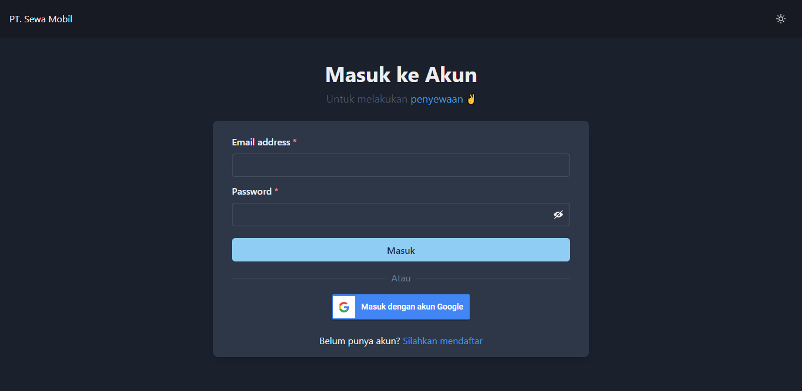
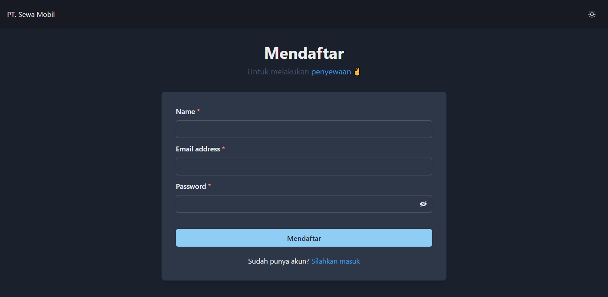

# Note
> This is just example frontend of my repository [Car-Management-API](https://github.com/nabilaba/Car-Management-API)

# User
- Login

- Register

# Role Akses
- superadmin

- admin

- member
